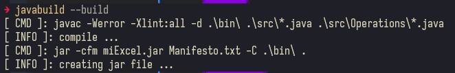
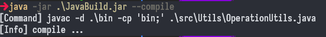

# Java build tool
- Basic build tool for simple java projects
- Build the project with 1 or 3 simple commands
- It works on WINDOWS & LINUX

- First build of the project.


- When you compile after the first build.


-----

# Dependencies
- [java_jdk_17.0.8](https://www.oracle.com/java/technologies/javase/jdk17-archive-downloads.html)
- [powershell](https://www.microsoft.com/store/productId/9MZ1SNWT0N5D?ocid=pdpshare)

# References
- [compile_references](https://docs.oracle.com/en/java/javase/17/docs/specs/man/javac.html)
- [create_jar_references](https://docs.oracle.com/javase/tutorial/deployment/jar/index.html)
- [run_java_references](https://docs.oracle.com/en/java/javase/21/docs/specs/man/java.html)
- [executables_from_jar_linux](https://stackoverflow.com/questions/44427355/how-to-convert-jar-to-linux-executable-file)
- [tsoding-nob](https://www.youtube.com/watch?v=l9_TUMZSewo&list=PLpM-Dvs8t0Va1sCJpPFjs2lKzv8bw3Lpw&index=5)

------

# Features 
- [x] compile the project to bin.
- [x] extracts the jar files inside lib to create later the project jar file.
- [x] create the project jar file.
- [x] run the project without using jar files.
- [x] build the project, combine the 3 previously mention.
- [x] create the folder structure of the project.
- [x] create the run powershell script and executes the project.
- [x] add cli option to the create build script to allow the user to name the script.
- [x] list the files that have a modified date more recent than the compiled files, to compile and build the project from the second time and further.
> Use `lastModified()` that returns a `long` value in milliseconds or 0L if file doesn't exists or when an I/O error occurs.

# TODO's
- [ ] add to the *--add* CLI command the aggregation of modules like the ones of *JavaFX*
- [ ] implement the module aggregation for compile, run, create-jar, execution script
- [ ] when *powershell* isn't installed use the default **cmd** option.
- [ ] add a mode to allow the user the `--watch` option, this option will serve as the live reload option of the compile process.
> Use `WatchService` to create a mode to compile at the same time that you change or modify the `.java` files
 
------

# How to

- Use the `.ps1` script to build the project.
```shell
build.ps1

or

./build.sh
```
> It will build the project and create the jar file to use for the *.exe* file creation.
>- Now you have the jar file to test the project functionality.

# Usage
- Use the executable
- This will print the **cli** commands that you can used.
```console
javabuild --h
```
>- Use the jar file to execute the program for the same purpose.
```console
java -jar JavaBuild.jar --h
```

## Manifesto usage

- When the app have dependencies in *lib* folder you need to specify in the *Manifesto* file if you want to 
include the extraction files of the lib dependency or you need to declara in the *Manifesto* the class path 
of the lib dependencies

```text
Manifest-Version: 1.0
Created-By: Author-Name
Main-Class: App
Class-Path: .\lib\dependencyFolder\dependency.jar
```
- When you declare the Class-Path the build operation when trying to create the project *.jar* file, it exclude
the extraction files of the lib dependency.

> If you don't declare the Class-Path the build operation when trying to create the project *.jar* file, now 
includes the extraction files of the lib dependency as part of the project *.jar* creation.

## list project files

- Use this to list the java `.class` or `.java` files inside the giving directory.
```shell
javaBuild -ls .\directory\
```

## Crete a project

- Use this to create the structure for the project.
- You need to provide the author
```shell
javaBuild -cb
```
> You can provide the author name
```shell
javaBuild -cb Author-Name
```
> Remember that the name of the directory where you are is the Name of the main class.
>- If the parent directory is `.\basic\` the main class file will be: `basic.java` and the main class declaration.
```java
public class basic {
    ...
}
```
- As soon you create the project you need to change the manifesto adding the main class.
```shell
javaBuild --i
```
- This will add the main class value to the manifesto.

## Compile

- To compile the project.
> `javaBuild --compile`.
>- It compiles the .java clases from `src` into `bin`, using the **Java version 23**, by default.
>- You can change those by providing:
```pwsh
javabuild --compile -s .\other\source -t .\other\target -r 17
```
> You can use the source, target or release options; or not it doesn't matter.
>- Also you can use them individually.

## Create a jar file of the project

- To create a jar file is necessary to include or verify dependencies or libraries in the project.
> In order to create the jar file we need to extract the content of all the jar files inside lib into: `extractionFiles`.
>- Use the extracted files to include the library files in the build process of the project *.jar* file.
>- `javaBuild --extract`.

- Now to create the project jar file.
- `javaBuild --jar`.
> It also can be created using source folder as parameter.
>- If you don't provide an argument it takes default value of `bin`
```pwsh
javabuild --jar -s .\testing\
```
- Remember that the manifesto determines the behavior for the build process.

## Create the build script

- Use this to create the build script for **powershell** in windows and **bash** for linux.
- Creates the script whit all the command to build the project, except the extraction operation.
- It uses the same commands and writes them in a file.
> It takes the `script_name` and `bin`.
>- You can change those by providing:

```shell
javaBuild --script script_name -s .\source\
```
>- Also you can use them individually.

## Create or modify the manifesto file
- The manifesto file, is necessary to include or verify if you want to add to the build the extraction of the dependencies or not.
> To include the extraction files of a dependency: `javabuild --i` otherwise `javabuild --i n` 
> To change the author of the `Manifesto`: `javabuild --i -a Author-Name`
> To change the main class: `javabuild --i --class App`


## Build the project

- All can be done with only 1 command
- It combines the commands: *compile* & *create jar* to build the project.
- The extraction of the jar dependency need to execute manually with: `--extract` and only one time per jar dependency.
- If you have configured the manifesto the dependency extraction will behave as describe previously.
> It takes the `src` and `bin` directories as source and target by default, using **Java version 23**.
>- You can change those by providing.
```shell
javaBuild --build -s .\source\ -t .\target\ -r 17
```
> You can use the source, target or release options; or not, it doesn't matter.
>- Also you can use them individually.

- There is also the option to build from scratch, it deletes the `.class` directory to get a fresh compilation of the `.java` files.
```sh
javaBuild --scratch
```
> You can provide the same arguments as in the build command.

## Run or execute the project

- Uses the class files and the main class to execute and run the application.
> it compiles to *.\bin\* folder and executes the project using the .class files.
>- you can specify the java class that you want to execute: 
```pwsh
javabuild --run .\src\App.java
```
- You can give also the source and target or release version at any time.
> The main class executed can be change by giving the `.java` file.
>- If you don't give the class to execute the project main class is selected.
>- You can change those by providing:
```pwsh
javabuild --run .\src\App.java -s .\source\ -t .\target\ -r 17
```
> You can use the source, target or release options; or not it doesn't matter.
>- Also you can use them individually.

>- Additional you can execute CLI command with this method too
```pwsh
javabuild --run --h
```

## Add an external jar dependency

- Used to add a framework or library file type *.jar*.
> `javabuild --add dependency.jar`
>- Add an external jar file to the lib folder of the project
>- Or you can use the directory name
>- `javabuild --add ./folderName`
>- Only works when the lib file don't contain modules.

------

# Additional info

This project use [javaBuild_tool](https://github.com/AlfonsoG-dev/javaBuild) to build itself.
- This app uses **powershell** to execute the commands on *WINDOWS*.
- This app uses **bash** to execute commands on *LINUX*.
- If you want to use the *CLI* tool you have to create an `.exe` file and place it in system path
- For **LINUX**
```bash
$ echo '#!/usr/bin/java -jar' > myBin
$ cat my.jar >> myBin
$ chmod +x myBin
$ ./myBin
```
- With that you can create an **environment variable** and use it from there.

------

# Disclaimer
- This project is for educational purposes.
- Security issues are not taken into account.
- Use it at your own risk.
